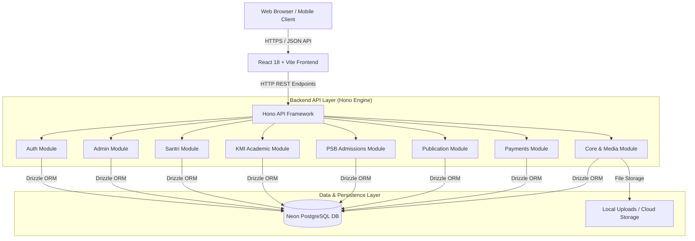

# Pesantren Hub - Architecture Overview & Technical Blueprint

## 1. Executive Summary

**Pesantren Hub** is an enterprise-grade Integrated Educational & Academic Management System designed specifically for modern Islamic Boarding Schools (Pesantren). It bridges administrative management, academic workflows (KMI curriculum), student admissions (PSB), payment processing, digital publishing, and public relations into a single unified platform.

Built with performance, security, and scalability in mind, Pesantren Hub uses a decoupled architecture featuring a **React 18 + Vite** single-page application frontend paired with a lightweight, high-performance **Hono API** backend powered by **Drizzle ORM** and **Neon PostgreSQL**.

---

## 2. High-Level Architecture Diagram

---

## 3. Technology Stack Summary

### Frontend Architecture
* **Core Framework**: React 18 + TypeScript
* **Build Tooling**: Vite
* **Styling System**: Tailwind CSS with Custom Dark Mode support & Design System
* **Icons**: Lucide React Icons
* **State Management**: Zustand & React Context
* **HTTP Client**: Axios with centralized interceptors & token refresh logic

### Backend Architecture
* **Framework**: Hono (Ultra-fast web framework for Node.js & Serverless)
* **Runtime**: Node.js / Serverless / cPanel compatible environment
* **ORM**: Drizzle ORM
* **Database**: Neon PostgreSQL (Cloud Native Serverless Postgres)
* **Validation & Schemas**: Zod validation schemas
* **Authentication**: JWT (JSON Web Tokens) with HttpOnly cookies & bearer tokens

---

## 4. Key Subsystem Capabilities

| Subsystem | Key Capabilities |
| :--- | :--- |
| **Auth & Security** | Multi-role RBAC, JWT auth, session tracking, account verification, login audit logs |
| **KMI Academic** | Curriculum planning, subject scheduling, grading systems, report cards (Rapor), class assignments |
| **PSB (Admissions)** | Online registration, document validation, exam/interview scheduling, payment verification |
| **Santri Management** | Student demographics, guardian link, violation logs, attendance, boarding room placement |
| **Publication Hub** | Academic journals, research papers, peer-review workflow, volume management, author profiles |
| **Financial Portal** | Automated billing, payment channel integration, payment verification, transaction histories |
| **Content & Media** | Dynamic blog system, news hub, asset gallery, media file log system |

---

## 5. Security & Access Control Model (RBAC)

Pesantren Hub enforces fine-grained Role-Based Access Control across 6 primary user roles:
1. **Superadmin**: Full unrestricted system access and configuration.
2. **Admin**: Operational management of students, academics, and finance.
3. **Staff / Teacher (Ustadz)**: KMI academic grading, schedule access, student attendance.
4. **Santri / Guardian (Wali)**: Personal profile, grade viewing, bill payment portal.
5. **Author / Reviewer**: Publication portal submission, journal review, and draft editing.
6. **Guest / Public**: Browsing public site, submitting admission forms, reading blogs & journals.

---

## 6. Architecture Documentation Index

For complete technical specifications, consult the dedicated documentation files:
1. [01-architecture-overview.md](./01-architecture-overview.md) - System Overview & Architecture
2. [02-database-schema-data-models.md](./02-database-schema-data-models.md) - Database Schema & Data Models
3. [03-backend-api-endpoints.md](./03-backend-api-endpoints.md) - Backend API Endpoint Documentation
4. [04-frontend-architecture.md](./04-frontend-architecture.md) - Frontend Architecture & UI Components
5. [05-assets-ui-showcase.md](./05-assets-ui-showcase.md) - UI Screenshots & Video Demo Showcase
6. [06-deployment-operations.md](./06-deployment-operations.md) - Deployment, CI/CD & Maintenance Guide
