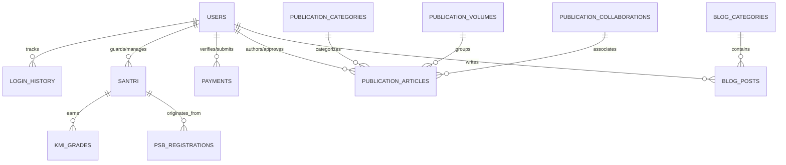

# Database Schema & Data Models Documentation

## 1. Overview

Pesantren Hub relies on a normalized relational PostgreSQL database managed via **Drizzle ORM**. The database schema is designed for high data integrity, soft-deletion capabilities, relationship tracking, and optimal query indexing.

---

## 2. Entity Relationship Overview

---

## 3. Detailed Table Specifications

### 3.1 User Management & Security (`users_user`)
Stores user accounts for Superadmins, Admins, Teachers, Parents/Guardians, and Publication Authors.

| Column Name | Type | Constraints | Description |
| :--- | :--- | :--- | :--- |
| `id` | `serial` | PRIMARY KEY | Unique user identifier |
| `username` | `varchar(150)` | UNIQUE, NOT NULL | Account login handle |
| `email` | `varchar(254)` | NOT NULL | Contact & notification email |
| `password` | `varchar(128)` | NOT NULL | Hashed password string |
| `role` | `varchar(20)` | NOT NULL | `superadmin`, `admin`, `teacher`, `santri`, `guest` |
| `phone` | `varchar(20)` | NOT NULL | Phone contact number |
| `avatar` | `text` | NULL | Profile image URL |
| `is_verified` | `boolean` | DEFAULT false | Identity verification status |
| `publication_role` | `varchar(20)` | DEFAULT 'none' | `author`, `editor`, `reviewer` |
| `created_at` | `timestamp` | NOT NULL | Account creation timestamp |

---

### 3.2 Research & Publication Module Tables

#### `publication_articles`
| Column Name | Type | Description |
| :--- | :--- | :--- |
| `id` | `serial` | Primary Key |
| `title` | `varchar(255)` | Article/Paper title |
| `slug` | `varchar(255)` | URL slug (unique) |
| `content` | `text` | Full markdown/HTML content |
| `author_id` | `integer` | Foreign Key -> `users_user.id` |
| `category_id` | `integer` | Foreign Key -> `publication_categories.id` |
| `volume_id` | `integer` | Foreign Key -> `publication_volumes.id` (For Journals) |
| `collaboration_id` | `integer` | Foreign Key -> `publication_collaborations.id` |
| `type` | `varchar(20)` | `article` or `journal` |
| `status` | `varchar(20)` | `draft`, `pending`, `approved`, `rejected` |
| `pdf_file` | `text` | Path to downloadable PDF |
| `views_count` | `integer` | Analytical read counter |

#### `publication_profiles` & `publication_collaborations`
* `publication_profiles`: Contains researcher bios, institution name, WhatsApp details, and research expertise fields.
* `publication_collaborations`: Holds group research workspace metadata and member role assignments (`owner`, `editor`, `viewer`).

---

### 3.3 Student & Academic Tables (Santri & KMI)

#### `santri` (Student Master Table)
* `id`, `nisn`, `nis`, `full_name`, `gender`, `birth_place`, `birth_date`
* `address`, `guardian_name`, `guardian_phone`, `status` (`active`, `alumni`, `mutasi`)
* `class_id`, `dormitory_room`, `created_at`

#### `kmi_subjects` & `kmi_grades`
* `kmi_subjects`: Code, subject title (Indonesian & Arabic), category, credit points.
* `kmi_grades`: Student ID, Subject ID, Semester, Mid-exam score, Final-exam score, Teacher evaluation notes.

---

### 3.4 Admissions System (`psb_registrations`)
* `id`, `registration_number`, `full_name`, `email`, `phone`, `nisn`
* `target_program`, `status` (`pending`, `document_verified`, `test_passed`, `accepted`, `rejected`)
* `payment_status`, `document_urls` (JSON array of certificate/KTP/KK scans)

---

### 3.5 Financial & Billing (`payments`)
* `id`, `bill_code`, `user_id`, `santri_id`, `amount`, `payment_type`
* `status` (`unpaid`, `pending_verification`, `paid`, `cancelled`)
* `proof_of_payment_url`, `verified_by_user_id`, `paid_at`, `created_at`

---

### 3.6 Media, Uploads & Content
* `blog_posts`: Article title, category, author, status, content, featured image.
* `media_files`: File path, mime type, size, owner, module scope.
* `core_settings`: Site title, hero banners, contact info, configuration JSON.
